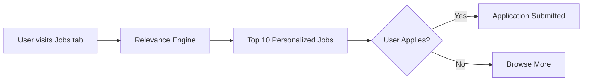

# LinkedIn – Job Match Relevance (Case Study)

## 📌 Overview
- **Industry:** Professional Networking / Recruiting  
- **PM Focus:** Search & Matching  
- **Goal:** Improve relevance of job recommendations so users find roles that match skills & aspirations.

## 🚩 Problem
- Many users see **irrelevant or over-generic job recommendations** (e.g., senior roles for juniors, wrong location).  
- Recruiters struggle with **low applicant quality** → wasted outreach.  
- Result: Frustration for both sides + lower engagement with Jobs tab.

## 🔍 Insights
- Job seekers value **personalized matches** over volume.  
- Skills & career trajectory are better predictors than just title matching.  
- Location & remote preferences have become critical filters post-COVID.  

## 💡 Proposed Solution — “Smart Relevance Ranking”
- Enhance ranking model with:
  - **Skills Graph**: inferred from profiles, endorsements, courses.  
  - **Career Progression Modeling**: suggest next-step roles, not just similar titles.  
  - **Preference Weighting**: location, remote/hybrid, salary bands.  
- Surface top 10 highly relevant matches instead of long uncurated lists.  

## 📊 KPIs
- +20% increase in **job apply CTR**.  
- +15% uplift in recruiter satisfaction (measured via quality-of-applicant survey).  
- -10% drop in “irrelevant recommendation” feedback reports.  

## 🗺 Roadmap
- **MVP (Q1):** Skills graph enrichment + location preferences  
- **V2 (Q2):** Career progression modeling  
- **V3 (Q3):** Salary preference + personalized ranking tuning  

## 🧪 Experiment Design
- A/B test against current job recommender  
- Metrics: CTR on job cards, application conversion, recruiter feedback  
- Segments: early-career vs mid-career vs senior  

## 🎨 Artifacts
- Wireframes in `/mocks`  
- Journey map in `/assets`  
- Event schema in `/data/schema.md`  

## 🧭 Trade-offs
- Complexity in skills graph expansion vs. scalability.  
- Need for bias checks (avoid reinforcing historical job mismatches).  

---

## 📚 Learnings
- Quality > Quantity: users value fewer but sharper recommendations.  
- Recruiter satisfaction improves when applicants are better aligned with postings.