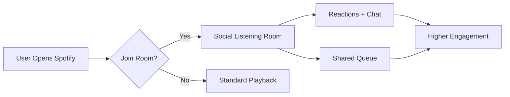

# Spotify – Social Listening (Case Study)

## 📌 Overview
- **Industry:** Music Streaming / Consumer Tech  
- **PM Focus:** Engagement & Virality  
- **Goal:** Increase **social stickiness** by letting users co-listen and share music experiences in real time.

## 🚩 Problem
- Spotify dominates in streaming but has limited **social interactions** compared to TikTok or Discord.  
- Current playlists/shares are *asynchronous* → no feeling of “listening together.”  
- Younger users crave **community and real-time connection**.

## 🔍 Insights
- Gen Z uses music as a **social signal** (identity & mood).  
- Competing apps (e.g. Stationhead, Twitch DJs) show demand for synchronous music experiences.  
- Retention is stronger when products support **shared rituals**.

## 💡 Proposed Solution — “Social Listening Rooms”
- Create ephemeral “rooms” where friends can listen to the same track/playlist together.  
- Features:
  - Host controls queue, others can react with emojis.  
  - Group chat overlay (text + quick reactions).  
  - Share room links via social (IG, WhatsApp, Discord).  

## 📊 KPIs
- +20% increase in **daily social interactions** (shares, invites, reactions).  
- +15% increase in **time spent per session** for co-listening users.  
- Retention boost: +10% 30-day active retention for Gen Z cohort.  

## 🗺 Roadmap
- **MVP (Q1):** Listening Rooms with invite links + reactions  
- **V2 (Q2):** Group chat overlay + basic moderation  
- **V3 (Q3):** Public Rooms & Artist-hosted live sessions  

## 🧪 Experiment Design
- Target: Gen Z user segment (18–24)  
- Randomized invite-only A/B  
- Metrics: Session length, social actions per DAU, retention  

## 🎨 Artifacts
- Wireframes in `/mocks`  
- Journey map in `/assets`  
- Event schema in `/data/schema.md`

## 🧭 Trade-offs
- Latency in sync streaming vs. UX smoothness.  
- Licensing rules for public rooms → need phased rollout (start private-only).  

---

## 📚 Learnings
- Music is not just consumption but *social glue*.  
- Features must balance **fun interactions** with **licensing/legal constraints**.