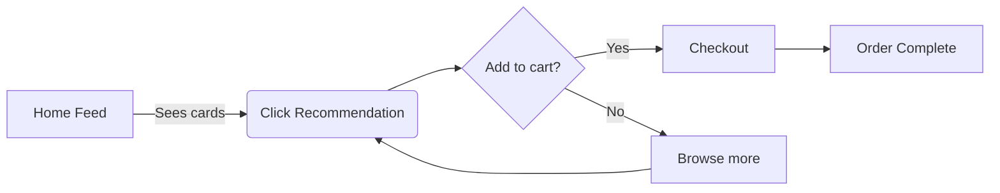

# Uber Eats – Taste Profile Engine (Case Study)

## 📌 Overview
- **Industry:** Food Delivery / Consumer Tech  
- **PM Focus:** Personalization & Engagement  
- **Goal:** More *relevant* suggestions to boost CTR and repeat orders.

## 🚩 Problem
Users see repetitive or irrelevant restaurant/meal suggestions → decision fatigue → lower conversion.

## 🔍 Insights
- Ordering patterns vary by **time of day** and **day of week**.
- **Dietary preferences** and **cuisine affinities** are underutilized.
- Context (weather, commute time) can nudge choices.

## 💡 Proposed Solution — “Taste Profile Engine”
- A lightweight profile per user built from:
  - Past orders (cuisine, spice, price band)
  - Time-of-day patterns
  - Explicit prefs (veg/non-veg, allergens)
- Real-time ranking reorders cards on the home feed.

## 📊 KPIs
- +15% CTR on “Recommended for you” cards
- +10% repeat orders per MAU in 90 days
- -8% time-to-first-click

## 🗺 Roadmap
- **MVP**: Meal tagging system + rule-based ranking  
- **V2**: Profile vectors + similarity ranking  
- **V3**: Context signals (weather/time windows)

## 🧪 Experiment Design
- A/B test with holdout (14 days)
- Primary: CTR; Secondary: Add-to-cart, Order completion
- Sample size calculator included in `/research/ab-plan.md`

## 🎨 Artifacts
- Wireframes in `/mocks`
- Journey map and opportunity tree in `/assets`
- Data schemas in `/data/schemas.md`

## 🧭 Trade-offs
- Model complexity vs. feed latency
- Cold start: fallback to cuisine/popularity priors

---

## 📚 Learnings
- Contextual personalization drives action when visible within 2 scrolls.
- Explicit preference capture reduces “irrelevance” complaints by power users.
